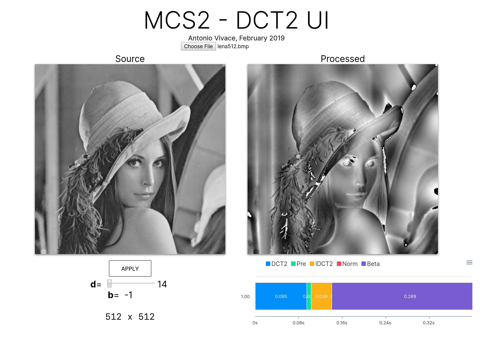

# MSC2-dct

Final project for the *Methods of Scientific Computing* course, from my MSc. Comparing naïve and scipy implementations of DCT2/IDCT2, while exposing the scipy implementation on a web app.

### [Slides](https://github.com/avivace/msc2-dct/blob/master/mcs2-slides.pdf)


### Deploy

Backend
```
python3 -m venv .
source bin/activate
pip3 install -r requirements.txt
# Online at 
```

Frontend
```
cd vueapp
npm install
npm run serve
```

App will be live at `localhost:8080` while the API is exposed at `localhost:5000`
